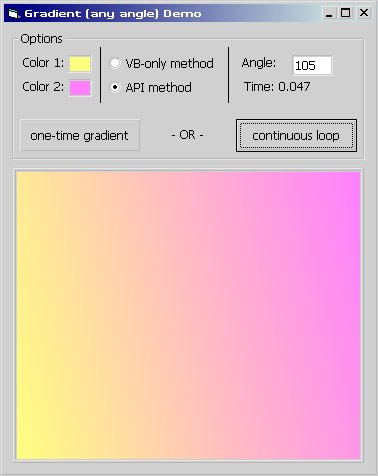



## Linear Gradients \(at any angle\)

### Description

-- Yes, another gradient. Highlights: can draw at any angle, is reasonably fast, is totally contained in one sub (no need to add a class or module). ---

See explanation.gif and the comments for a rough idea on how it works. ---

Also check out the demo picturebox, it is resizable at runtime. ---
 
### More Info
 

             |
---                |---
**Submitted On**   |2005-02-21 06:25:58
**By**             |[redbird77](https://github.com/Planet-Source-Code/PSCIndex/blob/master/ByAuthor/redbird77.md)
**Level**          |Intermediate
**User Rating**    |5.0 (20 globes from 4 users)
**Compatibility**  |VB 4\.0 \(32\-bit\), VB 5\.0, VB 6\.0
**Category**       |[Graphics](https://github.com/Planet-Source-Code/PSCIndex/blob/master/ByCategory/graphics__1-46.md)
**World**          |[Visual Basic](https://github.com/Planet-Source-Code/PSCIndex/blob/master/ByWorld/visual-basic.md)
**Archive File**   |[Linear\_Gra1855772212005\.zip](https://github.com/Planet-Source-Code/redbird77-linear-gradients-at-any-angle__1-59020/archive/master.zip)

